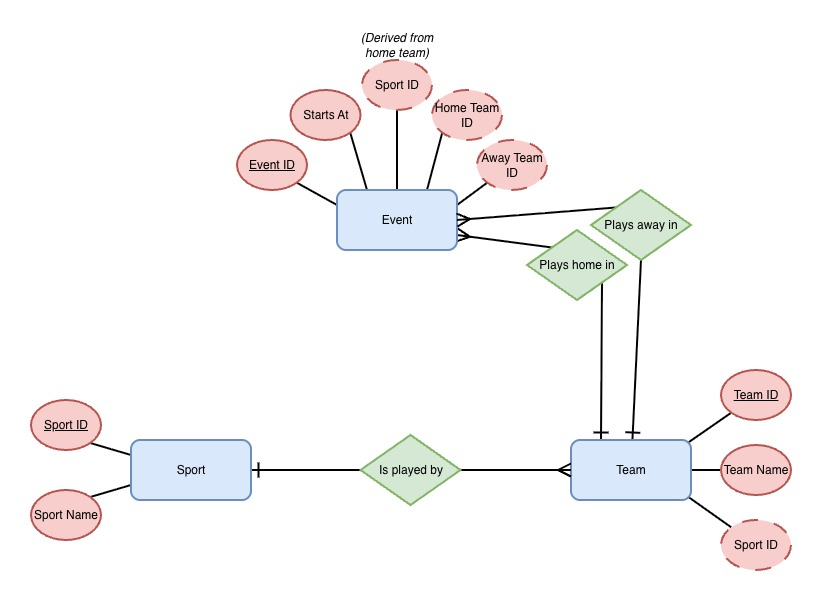

# Sportradar Coding Academy Coding Exercise (BE)

## Overview
A full-stack CRUD application built with Angular (Standalone), Node.js/Express, and PostgreSQL. The project demonstrates a complete decoupled architecture, utilizing Sequelize ORM for relational data mapping and Docker Compose for containerized orchestration. It features reactive searching, lazy-loaded routing, and a type-safe communication layer between the frontend and API.

## Database modelling


To ensure data integrity and eliminate redundancy, the database is designed following Third Normal Form (3NF) principles:

- Atomicity & Uniqueness (1NF): Every table (Sports, Teams, Events) contains unique records with primary keys, ensuring no repeating groups of data.

- Full Functional Dependency (2NF): All non-key attributes (e.g., team_name or event_start_time) are fully dependent on their respective primary keys.

- No Transitive Dependencies (3NF): Non-key columns do not depend on other non-key columns. For example, the Sport name is stored in its own table; the Team table only stores a sport_id foreign key.

## Accessing the application
```bash
cd sport-calendar
docker compose up --build
```
**Docker compose should also handle database creation (pulling PostgreSQL image -> setting up and populating the DB with mock data from [init.sql](./sport-calendar/db/init.sql))**

## Key features

- Adding a new event: using the landing page's sidebar, it is possible to add new events to the calendar, which updates in real-time.

- Browsing the event calendar: the right side of the landing page includes all entries within the current search criteria.

- Event calendar filters: allows optional adjustments of
  - sport played,
  - dateFrom,
  - \# of event.
  
- Event detail page: calendar events redirect to their detail pages when clicked.

## Questions

Thank you for your review. Were there any urgent remarks or issues with running the app, please contact me through [e-mail](mailto:hsylwesiuk@gmail.com).
